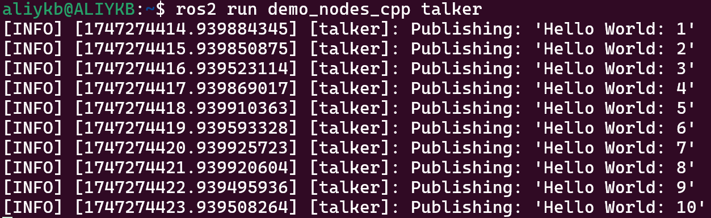
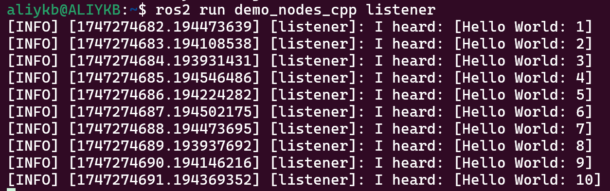
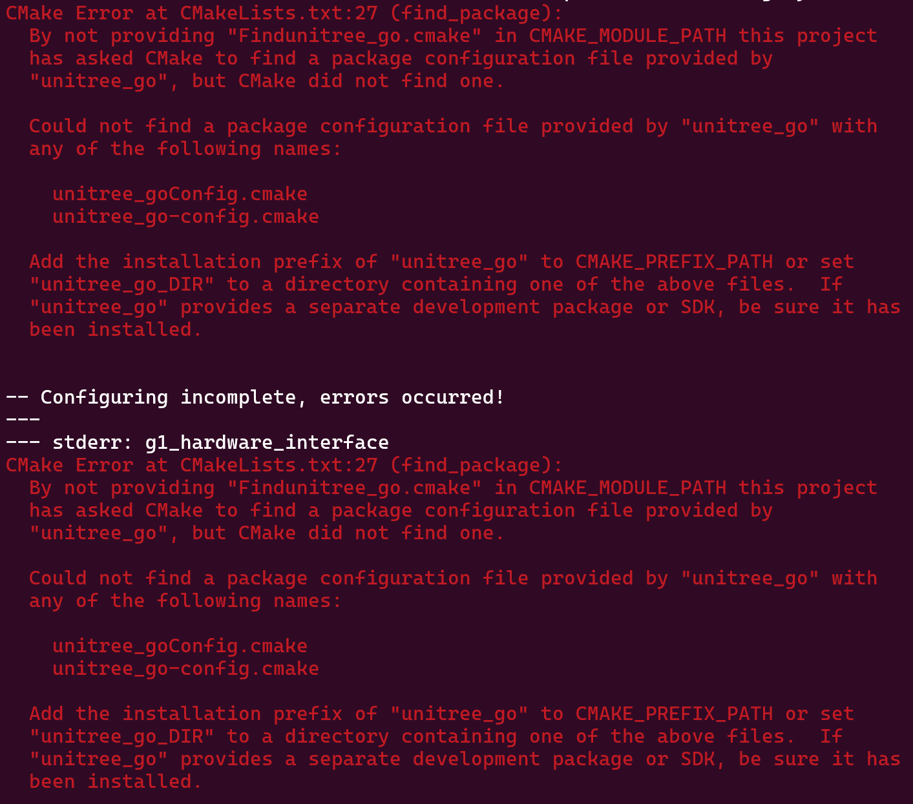
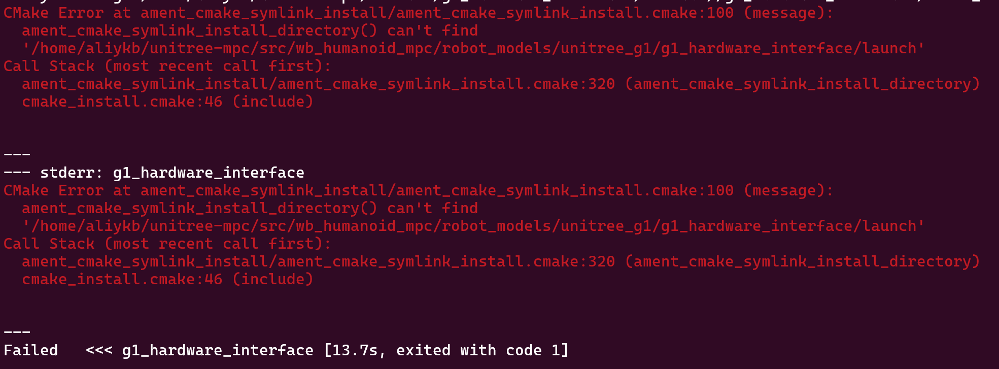

# 安装编译指南

[English](./README.md)|cn中文


## 基础环境安装

### 1. ROS2-jazzy

#### 安装

##### 安装方法1

```bash
wget http://fishros.com/install -O fishros && . fishros
```

##### 安装方法2

[ROS2-jazzy官方安装指南](https://docs.ros.org/en/jazzy/Installation/Ubuntu-Install-Debs.html)

#### 验证

打开**新终端1**，输入命令：

```bash
ros2 run demo_nodes_cpp talker
```

节点开始发布消息，如下：



打开**新终端2**，输入命令：

```bash
ros2 run demo_nodes_cpp listener
```

若此时未关闭**终端1**，则**终端2**中能够收到**终端1**的`talker`节点发布的消息，如下：



**ros2安装成功!**

#### 注-WSL2上安装ROS2

若在**wsl2**中安装ROS2，且设置了**wsl2**的网络模式为**镜像模式**，则会因为该模式影响ros2的消息传递，导致`listener`节点无法收到消息。

##### 解决方法1

为在打开`listener`节点前手动输入`ros2 daemon start`，打开ROS2的守护进程，此服务在系统终止前均有效

##### 解决方法2

输入如下命令，将命令写入`.bashrc`文件，在终端启动时自动运行

```bash
echo "ros2 daemon start" >> ~/.bashrc
source ~/.bashrc
```

### 2. Unitree-ros2

若未安装unitree-ros2包，则在后续编译时会出现如下错误：



#### 安装

在终端中输入以下命令：

```bash
cd ~
git clone https://github.com/unitreerobotics/unitree_ros2

sudo apt install ros-jazzy-rmw-cyclonedds-cpp
sudo apt install ros-jazzy-rosidl-generator-dds-idl
```

编译cyclonedds前请确保在启动终端时**没有**自动source ros2相关的环境变量，否则会导致cyclonedds编译报错。如果安装ROS2时在~/.bashrc中添加了 " source /opt/ros/jazzy/setup.bash "，需要修改 ~/.bashrc 文件将其注释：

```bash
# source /opt/ros/jazzy/setup.bash
# ros2 daemon start
```

打开新的终端，输入以下命令编译cyclone-dds：

```bash
cd ~/unitree_ros2/cyclonedds_ws/src
git clone https://github.com/ros2/rmw_cyclonedds -b jazzy
git clone https://github.com/eclipse-cyclonedds/cyclonedds -b releases/0.10.x 
cd ..
colcon build --packages-select cyclonedds #Compile cyclone-dds package
```

编译好 cyclone-dds 后就需要 ros2 相关的依赖来完成 Unitree 功能包的编译，因此编译前需要先 source ROS2 的环境变量激活ros2环境

```bash
source /opt/ros/jazzy/setup.bash
colcon build
```

在`~/unitree_ros2/setup.sh`与`~/unitree_ros2/setup_local.sh`中修改ros版本：foxy为jazzy，并**激活环境**，便于后续编译

```bash
source ~/unitree_ros2/setup.sh \\ 连接机器人实物时运行
source ~/unitree_ros2/setup_local.sh \\ 仅仅使用仿真时运行
```

### 3. 源码下载

创建工作空间并下载源码

```bash
cd ~
mkdir unitree-mpc && cd unitree-mpc
git clone https://github.com/sm-1z/unitree_mpc.git
```

下载的unitree_mpc中包含wb_humanoid_mpc与unitree_mujoco两个包，将两个包移动至根目录unitree-mpc下的src文件夹中，或直接将unitree_mpc改名为src

```bash
mv unitree_mpc src
```

最后目录的组成如下：

```bash
unitree_mpc
	-src
		-wb_humanoid_mpc
		-unitree_mujoco
```

### 4. 安装依赖

依照本地依赖文件安装依赖，在终端中输入以下命令安装：

```bash
cd src/wb_humanoid_mpc/
envsubst < dependencies.txt | xargs sudo apt install -y
```

## 编译源码

#### 编译wb_humanoid_mpc

编译前确保**终端中**根据具体条件运行了以下命令之一：

```bash
source ~/unitree_ros2/setup.sh \\ 连接机器人实物时运行
source ~/unitree_ros2/setup_local.sh \\ 仅仅使用仿真时运行
```

在终端中运行以下命令进行编译，此时位于`unitree-mpc/src/wb_humanoid_mpc/`目录下：

```bash
make build-all
```

#### 编译unitree_mujoco

首先编译相关依赖包，在终端中输入以下命令，此时位于`unitree-mpc/src/wb_humanoid_mpc/`目录下

```bash
make build PKG=mujoco
make build PKG=unitree_sdk2
```

编译unitree_mujoco：

```bash
source ~/unitree-mpc/install/setup.bash

cd ~/unitree-mpc/src/unitree_mujoco/simulate
mkdir build && cd build
cmake ..
make
```

运行

```bash
./unitree_mujoco
```

#### 报错



在`unitree-mpc/src/wb_humanoid_mpc/robot_models/unitree_g1/g1_hardware_interface`目录下新建launch文件夹

由于旧版本launch文件夹为空，未上传至github上，**新版本源码解决该问题**

#### 注-conda环境

makefile文件中指定了python解释器的位置，可能与conda的默认python解释器位置不符，出现报错时可以参考修改makefile

## 运行

编译完成后，在终端中输入以下命令运行，在终端中运行以下命令进行编译，此时位于`unitree-mpc/src/wb_humanoid_mpc/`目录下：

一旦你运行NMPC，一个带有Rviz的窗口将出现用于可视化。第一次为某个机器人模型启动MPC时，将生成自动微分代码，这可能需要5到15分钟，具体取决于你的系统。一旦完成，机器人将出现，你可以通过Xbox游戏手柄或终端中的控制来控制它。

对于**质心动力学模型预测控制**

```bash
make launch-g1-dummy-sim
```

对于**全身动态模型预测控制**

```bash
make launch-wb-g1-dummy-sim
```

运行mujoco

```bash
source ~/unitree_ros2/setup_local.sh
source ~/unitree-mpc/install/setup.bash
cd ~/unitree-mpc/src/unitree_mujoco/simulate/build
./unitree_mujoco
```

或

```bash
source ~/unitree-mpc/source_unitree.sh
# echo "source ~/unitree_ros2/setup_local.sh" >> ~/.bashrc
# echo "source ~/unitree-mpc/install/setup.bash" >> ~/.bashrc
cd ~/unitree-mpc/src/unitree_mujoco/simulate/build
./unitree_mujoco
```

对于**rviz与mujoco连接仿真**

1. 启动mujoco
2. 启动real-test

```bash
export ROS_DOMAIN_ID=1
cd ~/unitree-mpc/src/wb_humanoid_mpc/
make launch-wb-g1-real-test
```

## 参考资料

[ubuntu - wsl2使用镜像模式导致ROS2的通讯不可用? - SegmentFault 思否](https://segmentfault.com/q/1010000046011866)

[unitree_ros2/README _zh.md at master · unitreerobotics/unitree_ros2](https://github.com/unitreerobotics/unitree_ros2/blob/master/README _zh.md)